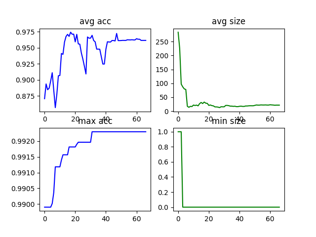

# Neural Architecture Search for Keras Sequential Models 

*Authors: Petra Vidnerová, Štěpán Procházka. The Czech Academy of Sciences, Institute of Computer Science.*

Genetic NAS based on NSGA, NSGAII or NSGAIII algorithms. Works for Sequential models only.

## Requirements:
Tensorflow, Keras, Deap, numpy, pandas, Scikit-learn

## Usage:

 TODO: move complete setup to one configuration file 
 
### Example:

 
# Docker
To run project code independently of your own system setup, `Dockerfile` with convenient `docker-compose` project is provided. Inside the container all the required stuff is installed and using the `docker-compose
`, project code is mounted for convenient exchange of data between container and the underlying machine.

Make sure you have `docker` and preferably `docker-compose` installed. Assuming that current working directory is the root of the repository, use following commands to run the project.

```
# runs docker container with jupyter lab server (available on `localhost:8888` by default)
docker-compose up

# terminate the container and free its resources
docker-compose down

# run command (e.g. interactive shell) inside the container
docker-compose exec nsga-keras /bin/bash

# builds the image (or rebuilds it if previous version exists)
docker-compose build
```

*TODO:* add support for GPU inside docker
